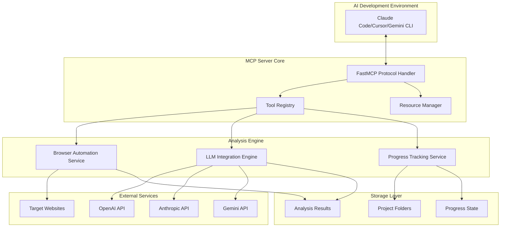
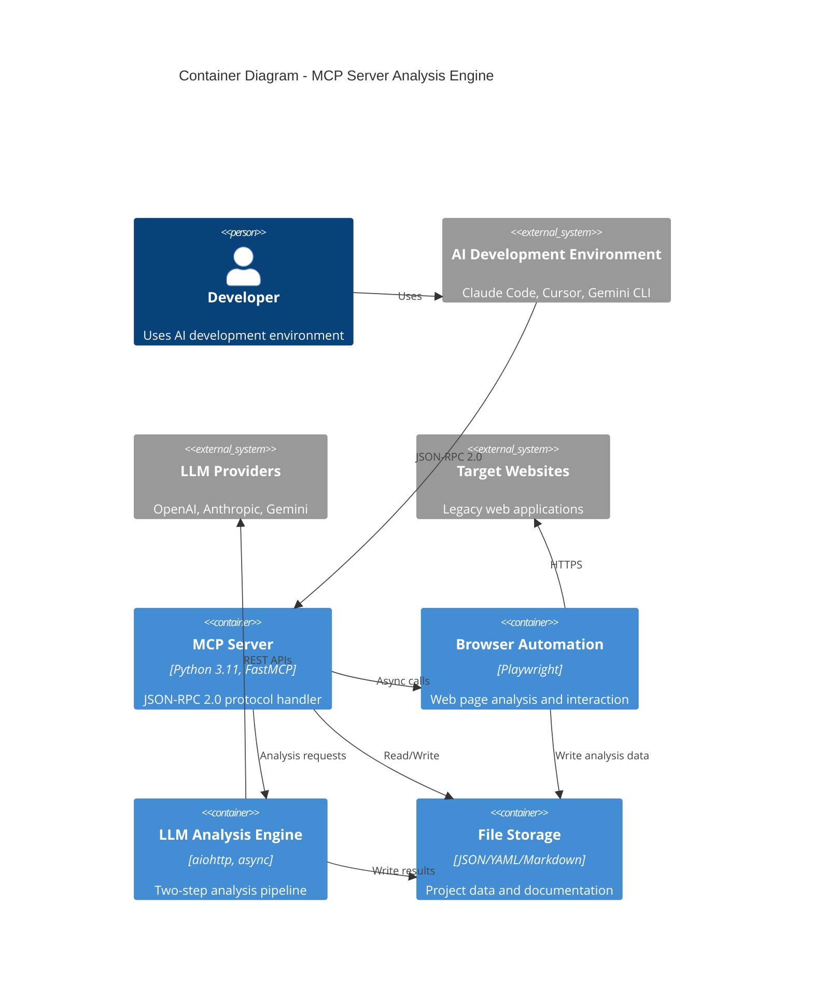
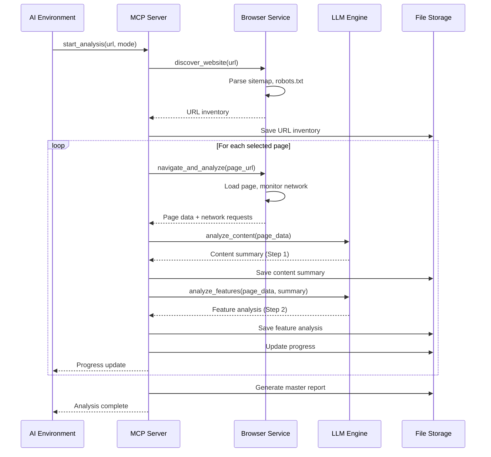
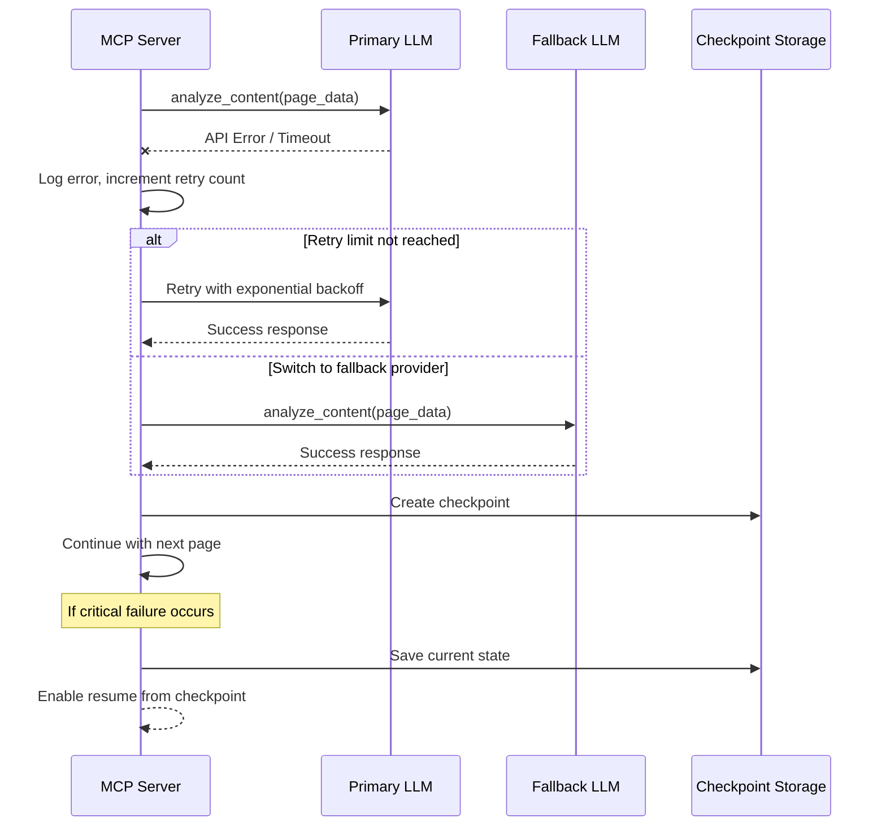

# Legacy Web Application Analysis MCP Server Architecture Document

## Introduction

This document outlines the overall project architecture for the Legacy Web Application Analysis MCP Server, including backend systems, shared services, and non-UI specific concerns. Its primary goal is to serve as the guiding architectural blueprint for AI-driven development, ensuring consistency and adherence to chosen patterns and technologies.

**Relationship to Frontend Architecture:**
This project is an MCP server with no frontend UI. All user interaction occurs through AI development environments (Claude Code, Cursor, Gemini CLI) via the MCP protocol. The architecture is entirely backend-focused, providing tools and resources for AI-powered web application analysis.

### Starter Template or Existing Project

N/A - This is a greenfield MCP server project built from scratch using the FastMCP framework. No existing starter template will be used, as MCP servers require specialized architecture for JSON-RPC 2.0 protocol implementation and web analysis capabilities.

### Change Log

| Date | Version | Description | Author |
|------|---------|-------------|---------|
| 2025-01-XX | 1.0 | Initial architecture document creation | Claude (AI Architect) |

## High Level Architecture

### Technical Summary

The Legacy Web Application Analysis MCP Server implements a modular monolith architecture within the MCP protocol framework, using Python 3.11 with AsyncIO for concurrent processing. The system leverages Playwright for browser automation, multi-provider LLM integration for intelligent analysis, and a two-step analysis pipeline that transforms web application data into actionable rebuild specifications. Core architectural patterns include dependency injection for service management, async/await patterns for concurrent browser sessions, and file-based stateless storage for project organization.

### High Level Overview

**Main Architectural Style:** Modular Monolith within MCP Server Framework
- Single deployable Python package with clear module boundaries
- MCP protocol handling as the primary interface layer
- AsyncIO-based concurrent processing for browser automation and LLM analysis

**Repository Structure:** Monorepo containing all components in a single repository for simplified dependency management and coordinated development

**Service Architecture:** Integrated services within single process:
- FastMCP framework handling JSON-RPC 2.0 protocol
- Playwright browser automation service with session management
- Multi-provider LLM integration engine
- File-based storage and documentation generation

**Primary Data Flow:**
1. User inputs website URL through AI development environment
2. MCP server discovers site structure and generates URL inventory
3. Browser automation analyzes each page individually with network monitoring
4. Two-step LLM analysis (content summarization → detailed feature analysis)
5. Structured documentation generation in project-specific folders
6. Progress tracking and checkpoint management for resumable analysis

**Key Architectural Decisions:**
- **Stateless Design:** No database required; all state stored in JSON/YAML files
- **Concurrent Processing:** 3-5 parallel browser sessions for efficient page analysis
- **Provider Agnostic:** Multi-LLM support with configuration-based model selection
- **Checkpoint Architecture:** Resume capability at individual page level

### High Level Project Diagram



### Architectural and Design Patterns

- **MCP Protocol Pattern:** JSON-RPC 2.0 based tool and resource exposure for AI development environments - _Rationale:_ Enables seamless integration with Claude Code, Cursor, and Gemini CLI for natural AI-assisted development workflows
- **Async Service Architecture:** AsyncIO-based concurrent processing with managed browser sessions - _Rationale:_ Supports parallel page analysis while maintaining resource control and error isolation
- **Two-Phase Analysis Pattern:** Separate content summarization and feature analysis steps with context passing - _Rationale:_ Optimizes LLM usage costs while ensuring comprehensive analysis quality
- **Checkpoint/Resume Pattern:** Stateful progress tracking with resumable analysis sessions - _Rationale:_ Handles long-running analyses of large websites with reliability and user convenience
- **Provider Facade Pattern:** Unified interface across multiple LLM providers with automatic fallback - _Rationale:_ Ensures analysis reliability while optimizing costs through intelligent model selection
- **File-Based State Management:** JSON/YAML storage for configuration and results without database dependency - _Rationale:_ Simplifies deployment and aligns with MCP server stateless principles

## Tech Stack

### Cloud Infrastructure

- **Provider:** None (Local execution only)
- **Key Services:** N/A - MCP server runs locally in user's development environment
- **Deployment Regions:** N/A - Local installation via pip/pipx

### Technology Stack Table

| Category | Technology | Version | Purpose | Rationale |
|----------|------------|---------|---------|-----------|
| **Language** | Python | 3.11+ | Primary development language | Enhanced async capabilities, performance improvements, required for modern FastMCP |
| **Framework** | FastMCP | latest | MCP server framework | Official Anthropic framework for MCP protocol implementation |
| **Browser Engine** | Playwright | 1.40+ | Web automation and analysis | Cross-browser support, network monitoring, reliable automation APIs |
| **Async Runtime** | AsyncIO | Built-in | Concurrent processing | Native Python async support for browser sessions and LLM calls |
| **HTTP Client** | aiohttp | 3.9+ | LLM API integration | Async HTTP client for concurrent API calls with proper timeout handling |
| **Configuration** | pydantic-settings | 2.1+ | Environment configuration | Type-safe configuration management with environment variable support |
| **Logging** | structlog | 23.2+ | Structured logging | JSON-structured logs for debugging and monitoring |
| **Testing** | pytest | 7.4+ | Test framework | Comprehensive testing with async support and browser automation |
| **Testing - Async** | pytest-asyncio | 0.21+ | Async test support | Native async test execution for browser and LLM testing |
| **Packaging** | setuptools | 68+ | Package distribution | Standard Python packaging for pip/pipx installation |
| **Type Checking** | mypy | 1.7+ | Static type analysis | Type safety for maintainable codebase |
| **Code Quality** | ruff | 0.1+ | Linting and formatting | Fast Python linter with formatting capabilities |

## Data Models

### Project

**Purpose:** Represents a complete website analysis session with metadata, configuration, and state tracking

**Key Attributes:**
- project_id: str - Unique identifier based on domain and timestamp
- website_url: str - Target website URL being analyzed
- created_at: datetime - Analysis session start time
- status: ProjectStatus - Current analysis state (discovering, analyzing, completed, failed)
- config: ProjectConfig - Analysis configuration and LLM model settings
- progress: ProgressState - Real-time progress tracking data

**Relationships:**
- Contains multiple Page entities for individual page analyses
- References URLInventory for discovered site structure

### Page

**Purpose:** Individual web page analysis with content, features, and network data

**Key Attributes:**
- page_id: str - Unique identifier within project scope
- url: str - Complete page URL
- title: str - Page title extracted from HTML
- status: PageStatus - Analysis status (pending, analyzing, completed, failed)
- content_summary: ContentSummary - Step 1 LLM analysis results
- feature_analysis: FeatureAnalysis - Step 2 LLM analysis results
- network_data: NetworkData - Captured API calls and requests
- analyzed_at: datetime - Completion timestamp

**Relationships:**
- Belongs to single Project
- Contains NetworkRequests and UIElements

### ContentSummary

**Purpose:** Step 1 LLM analysis output capturing page purpose and context

**Key Attributes:**
- purpose: str - Primary page purpose and business function
- user_context: str - Target users and user journey context
- business_logic: str - Core business rules and workflows
- navigation_role: str - Page's role in overall site navigation
- confidence_score: float - Analysis confidence level (0.0-1.0)

**Relationships:**
- Belongs to single Page
- Feeds context into FeatureAnalysis

### FeatureAnalysis

**Purpose:** Step 2 detailed technical analysis for rebuild specifications

**Key Attributes:**
- interactive_elements: List[UIElement] - Forms, buttons, controls with purposes
- business_rules: List[BusinessRule] - Validation logic and calculations
- api_integrations: List[APIEndpoint] - Backend dependencies and data flows
- rebuild_requirements: List[TechnicalRequirement] - Implementation specifications
- complexity_score: int - Estimated rebuild complexity (1-10 scale)

**Relationships:**
- Belongs to single Page
- References UIElements and APIEndpoints

## Components

### MCP Protocol Handler

**Responsibility:** Manages JSON-RPC 2.0 protocol communication with AI development environments, tool registration, and resource exposure

**Key Interfaces:**
- `/tools` endpoint for discovering available analysis tools
- `/resources` endpoint for accessing project status and results
- JSON-RPC 2.0 message processing for tool invocation

**Dependencies:** FastMCP framework, Tool Registry, Resource Manager

**Technology Stack:** FastMCP with async request handlers, pydantic for message validation

### Browser Automation Service

**Responsibility:** Manages Playwright browser sessions, page navigation, content extraction, and network monitoring for individual page analysis

**Key Interfaces:**
- `create_session()` - Initialize new browser context
- `navigate_and_analyze(url)` - Complete page analysis workflow
- `cleanup_session()` - Resource cleanup and session termination

**Dependencies:** Playwright Python library, AsyncIO task management

**Technology Stack:** Playwright 1.40+ with Chromium engine, async context managers for session lifecycle

### LLM Integration Engine

**Responsibility:** Unified interface for multiple LLM providers with automatic fallback, cost tracking, and the two-step analysis pipeline

**Key Interfaces:**
- `analyze_content(page_data)` - Step 1 content summarization
- `analyze_features(page_data, context)` - Step 2 feature analysis
- `get_provider_status()` - Health check for configured providers

**Dependencies:** aiohttp for API calls, provider-specific authentication

**Technology Stack:** aiohttp 3.9+ for async HTTP, pydantic models for API request/response validation

### Progress Tracking Service

**Responsibility:** Real-time progress monitoring, checkpoint management, and resume capability for long-running analyses

**Key Interfaces:**
- `update_progress(project_id, page_status)` - Progress state updates
- `create_checkpoint(project_id)` - Manual checkpoint creation
- `resume_from_checkpoint(project_id)` - Analysis resumption

**Dependencies:** File system storage, AsyncIO locks for state consistency

**Technology Stack:** JSON file storage with atomic writes, asyncio.Lock for thread-safe updates

### Documentation Generator

**Responsibility:** Converts analysis results into structured markdown documentation with organized project folders

**Key Interfaces:**
- `generate_page_report(page_analysis)` - Individual page documentation
- `generate_master_report(project)` - Comprehensive project analysis
- `update_incremental_report(project)` - Real-time report updates

**Dependencies:** Progress Tracking Service for status data, file system for output storage

**Technology Stack:** Jinja2 templates for markdown generation, structured file organization

### Component Diagrams



## External APIs

### OpenAI API

- **Purpose:** Primary LLM provider for content summarization and feature analysis
- **Documentation:** https://platform.openai.com/docs/api-reference
- **Base URL(s):** https://api.openai.com/v1
- **Authentication:** Bearer token via API key
- **Rate Limits:** 10,000 RPM, 2M TPM (varies by model and tier)

**Key Endpoints Used:**
- `POST /chat/completions` - GPT model inference for both analysis steps

**Integration Notes:** Configuration supports GPT-4, GPT-3.5-turbo, and 2025 GPT-5-nano for cost optimization

### Anthropic API

- **Purpose:** Secondary LLM provider with Claude models for analysis quality and cost optimization
- **Documentation:** https://docs.anthropic.com/claude/reference
- **Base URL(s):** https://api.anthropic.com/v1
- **Authentication:** x-api-key header
- **Rate Limits:** 5,000 RPM, 200k TPM (varies by model and usage tier)

**Key Endpoints Used:**
- `POST /messages` - Claude model inference for two-step analysis pipeline

**Integration Notes:** Supports Claude 3 family and 2025 Claude 3.7 Sonnet for high-quality feature analysis

### Gemini API

- **Purpose:** Fallback LLM provider and cost optimization option with Google's models
- **Documentation:** https://ai.google.dev/api/rest
- **Base URL(s):** https://generativelanguage.googleapis.com/v1
- **Authentication:** API key parameter
- **Rate Limits:** 15 RPM, 1M TPM (free tier), higher for paid

**Key Endpoints Used:**
- `POST /models/{model}:generateContent` - Gemini model inference

**Integration Notes:** Gemini 2.5 Flash-Lite for 2025 cost-optimized analysis workflows

## Core Workflows

### Page Analysis Workflow



### Error Recovery and Fallback



## Database Schema

N/A - This project uses file-based storage without a traditional database. Data is stored in structured JSON/YAML files with the following schema patterns:

**Project Metadata (project-metadata.json):**
```json
{
  "project_id": "string",
  "website_url": "string",
  "created_at": "ISO-8601 datetime",
  "status": "discovering|analyzing|completed|failed",
  "config": {
    "step1_model": "string",
    "step2_model": "string",
    "fallback_model": "string",
    "concurrent_browsers": "integer",
    "analysis_mode": "interactive|yolo"
  },
  "progress": {
    "total_pages": "integer",
    "completed_pages": "integer",
    "failed_pages": "integer",
    "current_page": "string|null",
    "estimated_completion": "ISO-8601 datetime"
  }
}
```

**Page Analysis (pages/page-{slug}.json):**
```json
{
  "page_id": "string",
  "url": "string",
  "title": "string",
  "status": "pending|analyzing|completed|failed",
  "analyzed_at": "ISO-8601 datetime",
  "content_summary": {
    "purpose": "string",
    "user_context": "string",
    "business_logic": "string",
    "confidence_score": "float"
  },
  "feature_analysis": {
    "interactive_elements": "array of objects",
    "business_rules": "array of objects",
    "api_integrations": "array of objects",
    "complexity_score": "integer"
  },
  "network_data": {
    "requests": "array of request objects",
    "api_endpoints": "array of endpoint objects"
  }
}
```

## Source Tree

```
legacy-web-analysis-mcp/
├── src/
│   └── legacy_web_mcp/
│       ├── __init__.py              # Package initialization
│       ├── main.py                  # MCP server entry point
│       ├── server.py                # FastMCP server configuration
│       │
│       ├── core/                    # Core business logic
│       │   ├── __init__.py
│       │   ├── models.py            # Pydantic data models
│       │   ├── config.py            # Configuration management
│       │   └── exceptions.py        # Custom exception classes
│       │
│       ├── mcp/                     # MCP protocol implementation
│       │   ├── __init__.py
│       │   ├── tools.py             # MCP tool implementations
│       │   ├── resources.py         # MCP resource providers
│       │   └── handlers.py          # Request/response handlers
│       │
│       ├── services/                # Business logic services
│       │   ├── __init__.py
│       │   ├── browser.py           # Playwright browser automation
│       │   ├── llm.py               # LLM integration engine
│       │   ├── analysis.py          # Two-step analysis pipeline
│       │   ├── progress.py          # Progress tracking service
│       │   └── documentation.py     # Documentation generation
│       │
│       ├── providers/               # LLM provider implementations
│       │   ├── __init__.py
│       │   ├── base.py              # Abstract provider interface
│       │   ├── openai.py            # OpenAI API integration
│       │   ├── anthropic.py         # Anthropic API integration
│       │   └── gemini.py            # Gemini API integration
│       │
│       └── utils/                   # Utility functions
│           ├── __init__.py
│           ├── file_manager.py      # File operations and organization
│           ├── url_utils.py         # URL parsing and validation
│           └── logger.py            # Structured logging setup
│
├── tests/                           # Test suite
│   ├── __init__.py
│   ├── conftest.py                  # Pytest configuration and fixtures
│   ├── unit/                        # Unit tests
│   │   ├── test_models.py
│   │   ├── test_browser.py
│   │   ├── test_llm.py
│   │   └── test_analysis.py
│   ├── integration/                 # Integration tests
│   │   ├── test_mcp_protocol.py
│   │   ├── test_browser_automation.py
│   │   └── test_end_to_end.py
│   └── fixtures/                    # Test data and mock responses
│       ├── sample_pages/
│       └── llm_responses/
│
├── docs/                            # Documentation
│   ├── architecture.md             # This document
│   ├── prd.md                       # Product requirements
│   └── api/                         # API documentation
│
├── scripts/                         # Development and deployment scripts
│   ├── install_browsers.py         # Playwright browser installation
│   ├── validate_setup.py           # Environment validation
│   └── generate_docs.py            # Documentation generation
│
├── templates/                       # Documentation templates
│   ├── page_analysis.md.j2         # Individual page report template
│   └── master_report.md.j2          # Master analysis report template
│
├── pyproject.toml                   # Project configuration and dependencies
├── README.md                        # Installation and usage guide
├── .gitignore                       # Git ignore patterns
├── .env.template                    # Environment variable template
└── LICENSE                          # MIT license
```

## Infrastructure and Deployment

### Infrastructure as Code

- **Tool:** N/A (Local installation only)
- **Location:** N/A
- **Approach:** Standard Python package distribution via PyPI

### Deployment Strategy

- **Strategy:** Local installation via pip/pipx
- **CI/CD Platform:** GitHub Actions for testing and package publishing
- **Pipeline Configuration:** `.github/workflows/test.yml`, `.github/workflows/publish.yml`

### Environments

- **Development:** Local development environment with pytest and browser automation
- **Testing:** GitHub Actions with headless browser testing
- **Production:** User's local development machine with AI environment integration

### Environment Promotion Flow

```
Development → Testing (GitHub Actions) → PyPI Package Release → User Installation
```

### Rollback Strategy

- **Primary Method:** pip/pipx uninstall and reinstall previous version
- **Trigger Conditions:** Critical bugs, compatibility issues with AI environments
- **Recovery Time Objective:** < 5 minutes for user to rollback to previous version

## Error Handling Strategy

### General Approach

- **Error Model:** Exception-based with structured error types and context preservation
- **Exception Hierarchy:** Custom exceptions inheriting from base `LegacyWebMCPError` with specific subtypes for browser, LLM, and MCP protocol errors
- **Error Propagation:** Async-safe error handling with proper context managers and resource cleanup

### Logging Standards

- **Library:** structlog 23.2+ with JSON formatter
- **Format:** Structured JSON logs with consistent field names and hierarchical context
- **Levels:** DEBUG (development), INFO (progress updates), WARNING (recoverable issues), ERROR (failures), CRITICAL (system failures)
- **Required Context:**
  - Correlation ID: `{project_id}-{page_id}-{timestamp}` format for tracing analysis sessions
  - Service Context: Component name, method, and operation type for debugging
  - User Context: Anonymized session info (no sensitive data in logs per security requirements)

### Error Handling Patterns

#### External API Errors

- **Retry Policy:** Exponential backoff (1s, 2s, 4s, 8s, 16s) with maximum 5 retries for LLM API calls
- **Circuit Breaker:** Open circuit after 10 consecutive failures, half-open retry after 60 seconds
- **Timeout Configuration:** 30s request timeout, 60s analysis timeout per page
- **Error Translation:** Provider-specific errors mapped to common error types with fallback provider switching

#### Business Logic Errors

- **Custom Exceptions:** `BrowserNavigationError`, `AnalysisFailureError`, `ConfigurationError` with specific context
- **User-Facing Errors:** Clear, actionable messages for MCP tool responses with remediation steps
- **Error Codes:** Structured error codes (e.g., `BROWSER_001`, `LLM_002`) for documentation and support

#### Data Consistency

- **Transaction Strategy:** Atomic file operations with temporary files and atomic moves for analysis results
- **Compensation Logic:** Checkpoint rollback on analysis failures with partial result preservation
- **Idempotency:** Resume capability ensuring duplicate page analysis detection and skipping

## Coding Standards

### Core Standards

- **Languages & Runtimes:** Python 3.11+ with AsyncIO, type hints mandatory for all functions
- **Style & Linting:** ruff for formatting and linting, mypy for type checking, 88-character line limit
- **Test Organization:** Tests in `tests/` directory mirroring source structure, `test_*.py` naming convention

### Naming Conventions

| Element | Convention | Example |
|---------|------------|---------|
| **Classes** | PascalCase | `BrowserAutomationService`, `LLMIntegrationEngine` |
| **Functions/Methods** | snake_case | `analyze_page_content`, `create_browser_session` |
| **Constants** | UPPER_SNAKE_CASE | `MAX_CONCURRENT_BROWSERS`, `DEFAULT_TIMEOUT_SECONDS` |
| **Files/Modules** | snake_case | `browser_service.py`, `llm_providers.py` |
| **Private Methods** | _leading_underscore | `_validate_response`, `_cleanup_session` |

### Critical Rules

- **Async/Await Consistency:** All I/O operations must use async/await; never use blocking calls in async contexts
- **Resource Cleanup:** Always use async context managers for browser sessions, HTTP clients, and file operations
- **Error Context Preservation:** Include original exception context when re-raising with `raise ... from e`
- **Type Safety:** All public functions must have complete type hints including return types
- **LLM Cost Tracking:** Log token usage and costs for all LLM API calls for budget monitoring
- **Browser Session Isolation:** Each page analysis must use isolated browser context to prevent state leakage
- **Configuration Validation:** Validate all environment variables at startup with clear error messages for missing values

## Test Strategy and Standards

### Testing Philosophy

- **Approach:** Test-driven development with comprehensive async testing and browser automation validation
- **Coverage Goals:** 90%+ unit test coverage, 80%+ integration test coverage, 100% critical path coverage
- **Test Pyramid:** 70% unit tests, 25% integration tests, 5% end-to-end tests with real browser automation

### Test Types and Organization

#### Unit Tests

- **Framework:** pytest 7.4+ with pytest-asyncio 0.21+
- **File Convention:** `test_{module_name}.py` in `tests/unit/` directory
- **Location:** `tests/unit/` mirroring source code structure
- **Mocking Library:** pytest-mock with async mock support
- **Coverage Requirement:** 90% line coverage for all business logic modules

**AI Agent Requirements:**
- Generate tests for all public methods with comprehensive async testing
- Cover edge cases and error conditions including LLM API failures and browser crashes
- Follow AAA pattern (Arrange, Act, Assert) with clear test naming
- Mock all external dependencies (LLM APIs, file system, browser operations)

#### Integration Tests

- **Scope:** Cross-service integration including MCP protocol, browser automation, and LLM pipeline testing
- **Location:** `tests/integration/` with service-specific test modules
- **Test Infrastructure:**
  - **Browser Testing:** Playwright with headless browsers for reproducible testing
  - **LLM APIs:** Mock responses using pytest-httpx for deterministic testing
  - **File System:** Temporary directories with cleanup for storage testing

#### End-to-End Tests

- **Framework:** pytest with full browser automation and real website testing
- **Scope:** Complete analysis workflows from URL input to documentation generation
- **Environment:** Isolated test environment with known test websites
- **Test Data:** Curated test websites with verified functionality for consistent validation

### Test Data Management

- **Strategy:** Fixture-based test data with realistic page content and network responses
- **Fixtures:** `tests/fixtures/` containing sample HTML, API responses, and configuration files
- **Factories:** Factory pattern for generating test objects with realistic data
- **Cleanup:** Automatic cleanup of temporary files and browser sessions after each test

### Continuous Testing

- **CI Integration:** GitHub Actions running full test suite on pull requests and main branch
- **Performance Tests:** Browser automation performance benchmarks with timing validation
- **Security Tests:** Static analysis with bandit for security vulnerability scanning

## Security

### Input Validation

- **Validation Library:** pydantic with custom validators for URL and configuration validation
- **Validation Location:** All external inputs validated at MCP tool entry points before processing
- **Required Rules:**
  - All URLs must be validated and sanitized before browser navigation
  - Environment variables validated at startup with type checking
  - MCP protocol messages validated against schema before processing

### Authentication & Authorization

- **Auth Method:** API key based authentication for LLM providers stored in environment variables
- **Session Management:** No user sessions; stateless operation with local execution model
- **Required Patterns:**
  - API keys loaded from environment variables only, never hardcoded
  - Local execution model ensures user data never transmitted to external services except LLM APIs

### Secrets Management

- **Development:** Environment variables in `.env` file (gitignored) with `.env.template` for setup
- **Production:** User-managed environment variables in their development environment
- **Code Requirements:**
  - NEVER hardcode API keys or sensitive configuration
  - Access secrets via pydantic-settings configuration only
  - No secrets in logs, error messages, or debug output

### API Security

- **Rate Limiting:** Respect LLM provider rate limits with exponential backoff and circuit breakers
- **CORS Policy:** N/A (no web interface)
- **Security Headers:** Standard HTTPS for all external API calls
- **HTTPS Enforcement:** All LLM API calls use HTTPS; browser navigation respects website protocols

### Data Protection

- **Encryption at Rest:** User-managed file system permissions for analysis results storage
- **Encryption in Transit:** HTTPS for all external API communication
- **PII Handling:** Local execution model; user data not transmitted except for analysis content to LLM APIs
- **Logging Restrictions:** No API keys, tokens, or sensitive website content in log files

### Dependency Security

- **Scanning Tool:** GitHub Dependabot for automated vulnerability scanning
- **Update Policy:** Monthly dependency updates with security patches applied immediately
- **Approval Process:** Security-critical updates merged within 48 hours after validation

### Security Testing

- **SAST Tool:** bandit for Python static security analysis
- **DAST Tool:** N/A (no web interface)
- **Penetration Testing:** N/A (local execution tool)

## Next Steps

After completing this architecture document, the following actions should be taken:

1. **Development Setup:**
   - Initialize Python 3.11 project with pyproject.toml configuration
   - Set up development environment with ruff, mypy, and pytest
   - Install and configure Playwright browsers for testing

2. **Core Implementation:**
   - Begin with Epic 1: Foundation & MCP Server Infrastructure
   - Implement FastMCP server with basic health check tools
   - Set up project structure and configuration management

3. **Testing Infrastructure:**
   - Establish test framework with async support
   - Create mock LLM responses for deterministic testing
   - Set up browser automation tests with headless browsers

4. **Documentation:**
   - Create comprehensive README with installation instructions
   - Document environment variable configuration
   - Provide usage examples for AI development environments

The architecture is optimized for AI-driven development with clear module boundaries, comprehensive type hints, and detailed specifications for consistent implementation across all components.