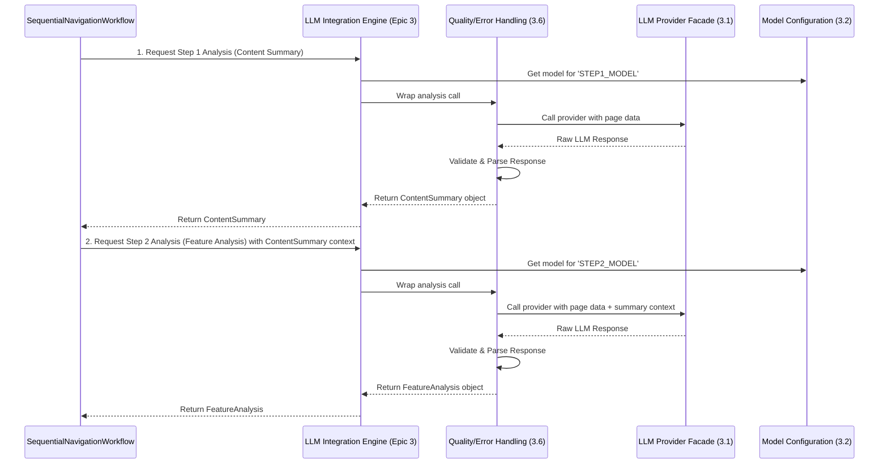

# Epic 3: LLM Integration Specification

## 1. Introduction

This document details the integration architecture for the components within **Epic 3: LLM Integration & Two-Step Analysis Pipeline**. It describes the control flow, data flow, and interaction between the stories to form a cohesive, intelligent analysis engine. This specification is derived from the primary `architecture.md` and `prd.md`.

## 2. Overall Workflow

The core of Epic 3 is a two-step analysis process orchestrated by the `SequentialNavigationWorkflow` (from Epic 2). For each page, the workflow invokes the `LLMEngine` twice.

## 3. Component Integration Details

### 3.1. LLM Provider Facade (Story 3.1)

The `LLMProviderInterface` acts as the foundation. Concrete implementations for OpenAI, Anthropic, and Gemini handle the specifics of authentication and API calls. The `LLMEngine` interacts with this interface, remaining agnostic to the specific provider being used.

### 3.2. Configuration-Based Model Selection (Story 3.2)

- Before each call (Step 1 or Step 2), the `LLMEngine` consults the `LLMConfigurationManager`.
- For Step 1, it requests the model specified by the `STEP1_MODEL` environment variable (e.g., a "fast" model for cost-efficiency).
- For Step 2, it requests the model for `STEP2_MODEL` (e.g., a more "accurate" model for detailed analysis).
- The `LLMConfigurationManager` resolves the logical name (e.g., "fast") to a concrete provider and model ID (e.g., `openai/gpt-5-nano`) from the `ModelRegistry`.
- This selection determines which provider from the facade (Story 3.1) is invoked.

### 3.3. The Two-Step Analysis Flow (Stories 3.3, 3.5, and 3.4)

The core of the analysis engine is a two-step process where the output of the first step directly informs the second. This ensures a deep, context-aware analysis of each web page.

#### **Step 1: Content Summarization (Story 3.3)**

- **Input**: The process begins with the `PageAnalysisData` object, which is a comprehensive collection of a page's artifacts gathered during Epic 2 (including HTML, DOM structure, interaction logs, etc.).
- **Process**: The `LLMEngine` invokes the configured `STEP1_MODEL`. The prompt guides the LLM to perform a high-level analysis of the page to understand its **purpose, target users, and overall business context**.
- **Output**: The result is a structured `ContentSummary` object. This object does not contain technical details but rather a semantic understanding of the page.

#### **Step 2: Context-Aware Feature Analysis (Stories 3.5 & 3.4)**

- **Context Passing (Story 3.5)**: This is the crucial integration step. The `ContentSummary` object generated in Step 1 is now treated as essential **context**.
- **Input**: The `LLMEngine` is invoked for a second time. This call receives two key inputs:
    1. The original `PageAnalysisData`.
    2. The `ContentSummary` object from Step 1.
- **Process**: The prompt for this second call, using the more powerful `STEP2_MODEL`, explicitly instructs the LLM to use the provided summary context to perform a detailed **technical feature analysis**. For example, knowing the page is for "user profile updates" (from Step 1) helps the LLM correctly interpret the purpose of forms and API calls (in Step 2).
- **Output**: The result is a structured `FeatureAnalysis` object, containing detailed rebuild specifications, business rules, and API integration points, all interpreted within the proper business context.

### 3.6. Analysis Quality and Error Handling

- This component acts as a wrapper around every call made through the `LLMProviderInterface`.
- **Validation (AC1)**: When a raw response is received from a provider, it is immediately validated against the target Pydantic schema (`ContentSummary` or `FeatureAnalysis`). If parsing fails, it triggers an error.
- **Retry/Fallback (AC2)**: On failure (e.g., validation error, API timeout, malformed JSON), the error handler initiates a retry. It may use the same model or consult the `LLMConfigurationManager` (Story 3.2) to escalate to the `FALLBACK_MODEL`. This logic is governed by the policies (e.g., max retries) defined in the architecture.
- **Quality & Confidence Scoring (AC3, AC6)**: After a successful response is parsed, a quality score is computed based on the completeness and specificity of the returned data. This score is attached to the final data object.
- **Error Logging (AC4)**: All failures, retries, and fallbacks are logged with structured context (page URL, model used, error type) for debugging.
- **Partial Results (AC5)**: If Step 1 succeeds but Step 2 repeatedly fails, the workflow ensures the `ContentSummary` is saved as a partial result before the page is marked as 'failed'.

## 4. Data Flow

The integration is orchestrated through a clear data flow using strongly-typed data models:

1.  **`PageAnalysisData`**: The initial, comprehensive data bundle from Epic 2 containing all raw information about a page. It is the primary input for both Step 1 and Step 2.

2.  **`ContentSummary`**: The output of the Step 1 analysis. It is stored and also becomes a crucial *input* for the Step 2 analysis, fulfilling the context-passing requirement.

3.  **`FeatureAnalysis`**: The output of the Step 2 analysis.

These three objects are ultimately aggregated to represent the complete analysis for a single page, which is then used by the documentation and reporting systems in Epic 4.
