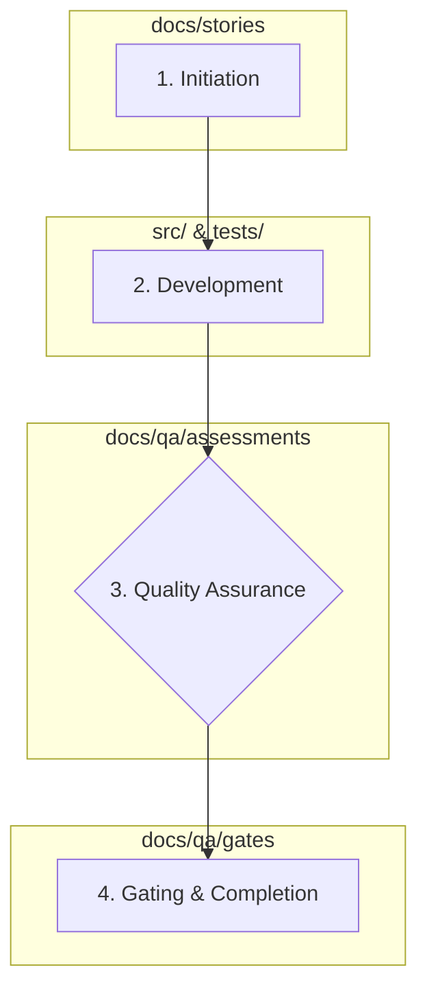

# Story Development Workflow

This document outlines the standard process for developing, testing, and completing a user story within the Legacy Web Application Analysis MCP Server project. Adhering to this workflow ensures consistency, quality, and comprehensive documentation for every feature.

## 1. Overview

The development process for a story is managed through a series of documents primarily located in the `/docs` directory. The lifecycle of a story follows four main phases: Initiation, Development, Quality Assurance, and Gating & Completion.

## 2. The Story Lifecycle

### Step 1: Initiation

- **Artifact**: Story Markdown File
- **Location**: `docs/stories/X.Y.story-name.md`

Every new feature begins as a story file. This file is the central hub for the story's lifecycle.

- **Initial State**: The file is created with an `Approved` status. It contains:
    - The user story (As a..., I want..., so that...).
    - A detailed list of Acceptance Criteria (ACs).
    - A checklist of tasks/subtasks required for implementation.

### Step 2: Development

- **Artifacts**: Source Code, Unit/Integration Tests, Updated Story File
- **Location**: `src/`, `tests/`, `docs/stories/`

The developer (or AI agent) assigned to the story performs the following:

1.  **Implement Code**: Write the necessary source code in the `src/legacy_web_mcp/` directory, following the established architecture and coding standards.
2.  **Implement Tests**: Write corresponding unit and integration tests in the `tests/` directory to validate the new code and cover the acceptance criteria.
3.  **Update Story File**: As work progresses, the developer updates the story's markdown file:
    - Check off completed tasks in the `Tasks / Subtasks` section.
    - Fill out the `Dev Agent Record` section with:
        - `Agent Model Used`: The AI model used for assistance.
        - `Debug Log References`: Key commands used for testing/debugging.
        - `Completion Notes List`: A summary of the implementation.
        - `File List`: A list of all new or modified files.

### Step 3: Quality Assurance (QA)

- **Artifacts**: QA Assessment Documents
- **Location**: `docs/qa/assessments/`

This phase is a highly structured documentation and review process. For each story `X.Y`, the QA team (or a designated agent) creates a set of assessment documents. The naming convention includes the story number and the date (`YYYYMMDD`).

1.  **Test Design**: `X.Y-test-design-YYYYMMDD.md` - Outlines the test strategy, scenarios, and priorities.
2.  **Requirements Traceability**: `X.Y-trace-YYYYMMDD.md` - Maps each acceptance criterion to specific tests, ensuring full coverage.
3.  **Risk Profile**: `X.Y-risk-YYYYMMDD.md` - Identifies technical, operational, or security risks, assigning a score and outlining mitigations.
4.  **NFR Assessment**: `X.Y-nfr-YYYYMMDD.md` - Evaluates the implementation against Non-Functional Requirements (Security, Performance, Reliability, Maintainability).

These documents are reviewed and updated iteratively until the story is deemed ready for the final gate.

### Step 4: Gating & Completion

- **Artifacts**: QA Gate File, Updated Story File
- **Location**: `docs/qa/gates/`, `docs/stories/`

1.  **Pass the Gate**: A final QA gate summary is created at `docs/qa/gates/X.Y-story-name.yml`. This YAML file:
    - Declares a final `gate: PASS` or `gate: FAIL` status.
    - Provides a `status_reason`.
    - Includes a `quality_score`.
    - Summarizes the findings from the traceability, risk, and NFR assessments.

2.  **Finalize Story**: Once the gate is passed:
    - The `QA Results` section in the story's markdown file (`docs/stories/X.Y.story-name.md`) is filled with a summary of the review and a link to the gate file.
    - The story's status is updated from `Approved` to `Ready for Done`.

3.  **Commit**: All the modified and new files (source code, tests, and all documentation) are committed to the repository with a message referencing the story.
